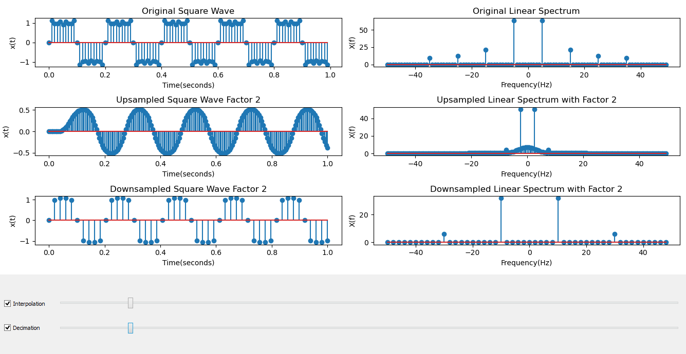

# Sampling Interface
In this program, upsampling and downsampling of signals tried to be visualized via an interface. One can activate interpolation or decimation. Also one can adjust the interpolation or decimation factor by sliding the slider from left to right vice versa. Results will be seen automatically on figures.
