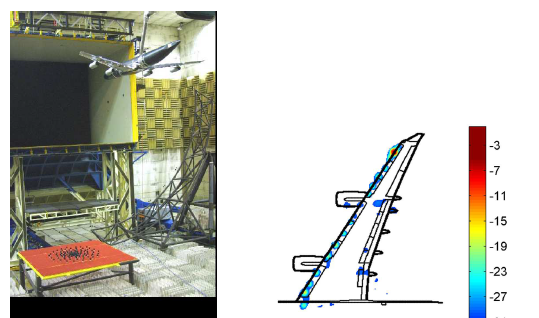
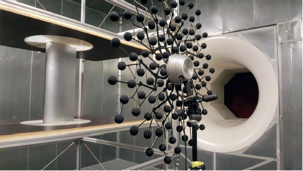
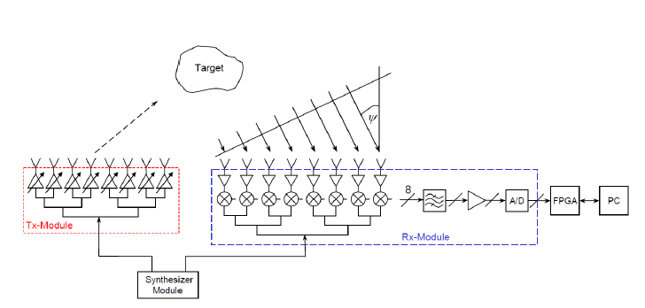
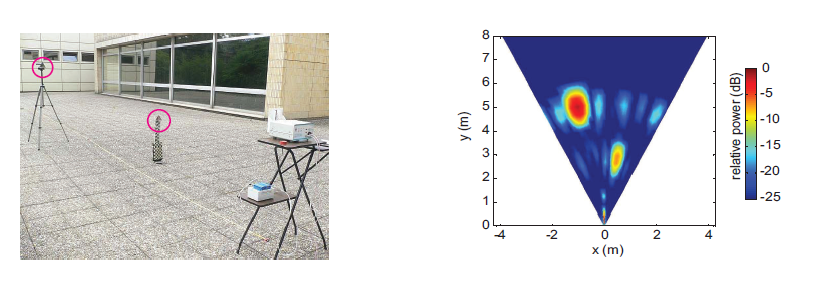

# Acoustics I - Noise Source Location
Acoustic beamforming is a technique to measure the sound pressure thanks to some microphones arrays and also that is able to locate the sound source, either meaningful or noise by processing the collected sound signals. This technique involved in many academic and industrial applications. In daily life, sound noise is one of the main problems of today's world. Every produced vehicle, machine, or tool has to have a sound noise below some certain level according to some standards[1]. Detecting the noise source in a device is a challenging task for engineers. However, beam forming is one of the most successful noise localization techniques that allows engineers to distinguish each and individual noise sources[2].

Thanks to all development in technology, we are able to build robust microphone arrays that are equipped with more than a hundred microphones which allows us to perform precise noise source localization[1]. One can face the noise source localization problem in automotive, telecommunication, aerospace industry, etc. Noise source localization of airfoil will be explained here as an example.  

Nowadays, environmental issue is one of the most dominant problems in the air transportation system. Airplanes should make as little noise as possible during landing and taking off. Understanding which part causes noise in airplanes requires long-term research and technical infrastructure on its own. Although there are many methods, the beam forming method will be explained.

In the photo below, a scaled aircraft is used to investigate the noise which is caused on the wings by the wind turbine air. In order to find the exact location of the noise, microphone arrays are placed on the ground and the calculated noise powers can be seen in the right of the below image.   

In another application of airfoil noise localization which is performed in the University of Twente Aeroacoustic Wind Tunnel, the set-up with 112 digital MEMS microphones and FPGA is used for noise source measurement which is given in the image below.

In this application, the wind is coming from left to right and the placement of the microphones or sensors is optimized to improve the array performance. That's why the placement of the arrays also affects the result of beam forming. 

Delay and Sum technique is already explained before. The area where the noise source is likely to be is divided into grids. Each point of these grids is considered as a noise source and the source pressure levels ​​are obtained by applying the delay-and-sum technique to the signals coming from the points. These values can be presented on a counter map[3].

In the given image above, m represents the microphones, x represents the possible noise source in an area and all the signals are captured by the microphones. Output Map is given for only one location which can be calculated with the given formula below. [1] 

Here M is the total number of microphones, pm is the signal measured by each microphone, x1 is the one possible source position, x is the microphone position. 

Here the t0 is important because it represents the delay and intentionally added to the equation. For each node or possible source location, the signal measured by each microphone is delayed according to the behinded time with the given formula below.

# Beamforming in Radar
Radars are electromagnetic sensors which are used for range,angle or velocity determination of objects. They can be used for detecting motor vehicles, spacecraft,cars etc. There might be one or more than one transmitter and receiver antennas in radar to detect the mentioned properties of any object. In principle ra
In principle, radars send signals from transmitters and the signals they send come back by hitting an object. The returning signals are picked up by the receivers.
The distance of an object in the coverage area of ​​the radar is calculated by the time it takes the signal to leave and return to the radar. There are a lot of different application of radar in industry and acedemiy[https://en.wikipedia.org/wiki/Radar_configurations_and_types] however I am gonna explain the **digital beamforming radars**. Beside getting velocity, digital beamforming radars provides distance and angular information of possible target objects. In general, good angular resolution which means large filed of view is required for many applications. In order to achive this high resolution, number of receiver and transmitter should be increased. For example eight transmitter and eight receiver on a radar can be one option and multiple tranceiver and transmitter configuration can be seen in the image below.[C2010 Harter Amodular].

I am gonna explain an application where two stationary objects are aimed to be detected by the radar. In order to detect them, radar has to calculate the distance of the object by consedering time delay during the propagation and has to calculate the angle where the object is located by considering the frequency domain of the signal. To get this, FFT is used in the receiver part because the frequency modulation characteristic.

After getting the angle and distance the location of the objects can be obtained. 
On the left side of figure below, two corner reflectors are placed with different distance and hight in front of the radar. Each corner reflectors have different cross sections. In the radar, frequency modulated continues waves are used and the image at the right side of the given image below is obtained after applying the beam forming in which one can see where the relative power is increasing which represents the object in x,y direction in meter. Radar is located at 0,0 and right side is positive in x coordiante and left side of the radar is negative.

# References : 

1. Department Thermal Fluid Engineering University of Twente (n.d.) Fundamentals of Acoustic Beamforming, P.O. Box 217 Enschede, 7500 AE The Netherlands: Leandro de Santana.
2. National Instruments (n.d.) Using Acoustic Beamforming for Pass-By Noise Source Detection, P.O. Box 217 Enschede, 7500 AE The Netherlands: Doug Farrell,Product Manager.
3. (2003) Noise Source Location Techniques – Simple to Advanced Applications, P.O. Box 217 Enschede, 7500 AE The Netherlands: Mehdi Batel and Marc Marroquin, Brüel & Kjær North America, Inc., Norcross, Georgia Jørgen Hald, Jacob J. Christensen, Andreas P. Schuhmacher and Torben G. Nielsen, Brüel & Kjær, Denmark.