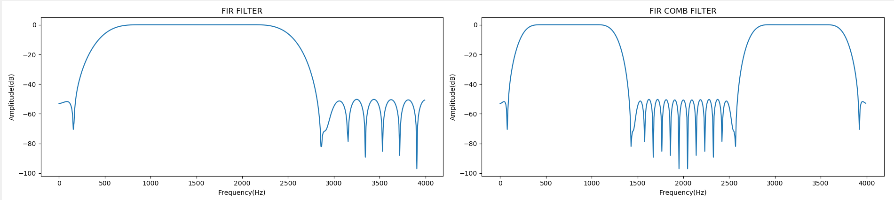
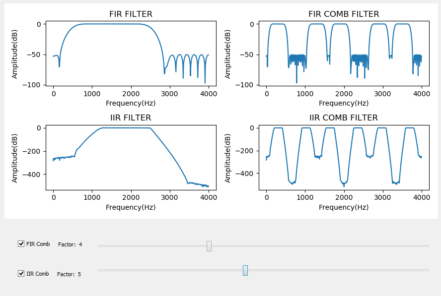

# Comb Filter

* Comb filter is repetition of one filter many times. Thanks to this behavior, comb filters can filter several frequency components with only one filter. It can be IIR or FIR. 
* The given figure below shows on the left-hand side the FIR filter and on the right-hand side the comb filter which is created by using the left FIR filter by factor 1. When the factor is equal to 1, this indicates that one zero is inserted between two filter coefficients. For factor 2 one should insert two zeros between two filter coefficients to obtain the Comb filter with factor 2. Actually, the sampling frequency is increased with this method.

In general thanks to the sliders which are given below figures, one can adjust the factor value by sliding the slider right or left. Affect of the factor can be observed on the Comb figures for IIR and FIR filters. On the other hand, you can enable and disable the sliders thanks to the given two checkboxes.

     

Intentionally I did not give ability to the user to change the filter itself, because the purpose of this program is only showing the result of comb filter design not visualizing the affact of sampling frequency or window type of filter. 